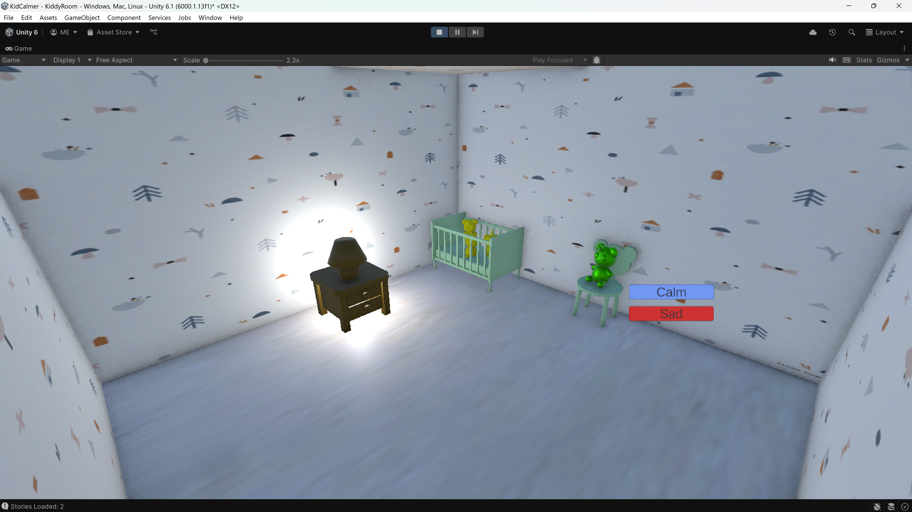
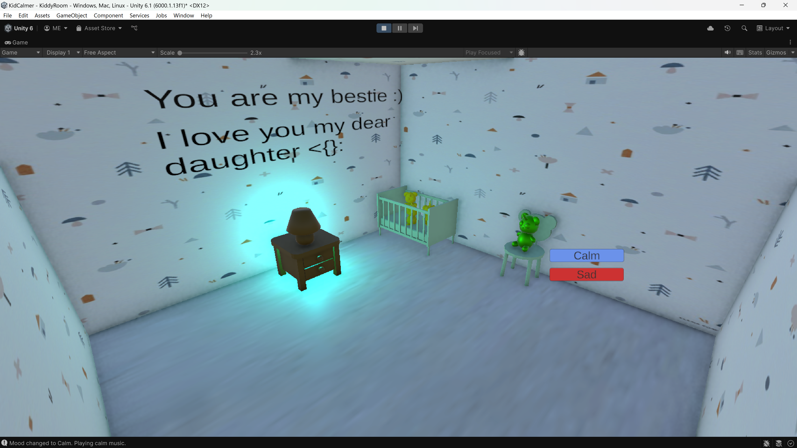
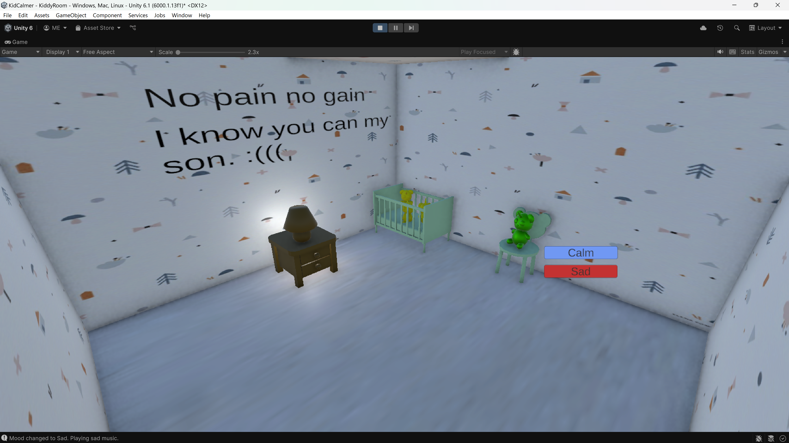

# Kiddy
WinsAcademyTask

## Features
- Mood system (Calm / Sleep) using the Observer pattern:
  - Changes room lighting and music based on mood
- Story display:
  - Reads stories from a JSON file
  - Shows story text on the wall in the room
  - Plays story audio

## How to change mood
Use `MoodManager.Instance.SetMood(Mood.Calm);` to set the mood.

```csharp
using System;
using System.Collections.Generic;
using UnityEngine;

public class MoodManager : MonoBehaviour
{
    public static MoodManager Instance;
    private List<IMoodObserver> observers = new List<IMoodObserver>();
    private Mood currentMood = Mood.Calm;

    void Awake()
    {
        if (Instance == null)
        {
            Instance = this;
            DontDestroyOnLoad(gameObject); // if you need it across scenes
        }
        else
        {
            Destroy(gameObject);
        }
    }

    public void RegisterObserver(IMoodObserver observer)
    {
        if (!observers.Contains(observer))
            observers.Add(observer);
    }

    public void RemoveObserver(IMoodObserver observer)
    {
        observers.Remove(observer);
    }

    public void SetMood(Mood newMood)
    {
        currentMood = newMood;
        NotifyObservers();
    }

    private void NotifyObservers()
    {
        foreach (var obs in observers)
        {
            Debug.Log($"Notifying observer: {obs.GetType().Name} of mood change to {currentMood}");
            obs.OnMoodChanged(currentMood);
        }
    }

    public Mood GetCurrentMood()
    {
        return currentMood;
    }
}

```

## Observer interface for objects need to listen to mood changes
```csharp
public enum Mood
{
    Sad,
    Calm
}

public interface IMoodObserver
{
    void OnMoodChanged(Mood newMood);
}
```

## Example of mock data.json
```json
[
  {
    "title": "You are my bestie :)",
    "description": "I love you my dear daughter <{}:",
    "mood": "calm"
  },
  {
    "title": "No pain no gain",
    "description": "I know you can my son. :(((",
    "mood":"sad"
  }
]
```

## Screenshots
### Room Overview


### Story1 Calm Button Clicked


### Story 2 Sad Button Clicked
